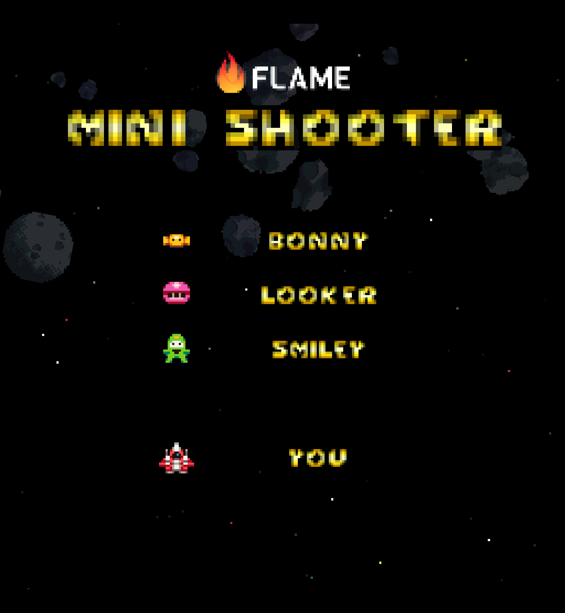
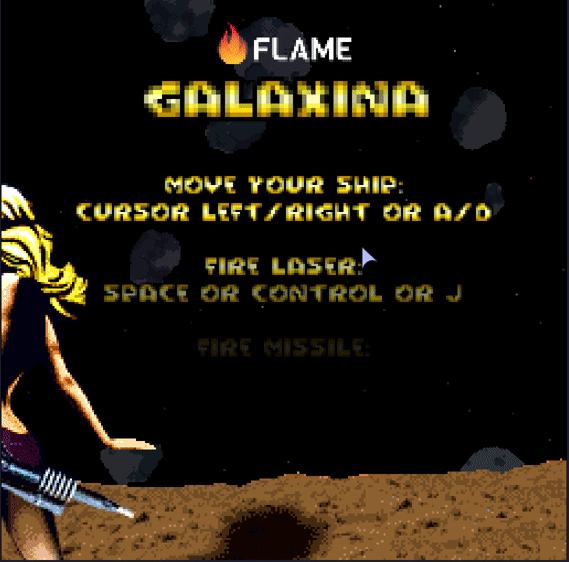

# Mini Shooter

A Flutter Flame V-SHMUP Game Demo

This is a basic Galaga style SHMUP game demo.

**NOTE: Still missing most functionality!**

Using this as a playground for prototyping ideas for another game.

Assets from https://itch.io/ and background music from https://suno.com/.

## To Do

Probably not taking this too far. But here's what probably will be done in the
next few days:

* [X] laser charge extra => laser recharge rate
* [X] have enemies wander left/right a bit
* [X] have single enemies attack galaga style
* [X] have combined enemy attacks galaga style
* [X] use tiled for the levels
* [X] challenging stage every five levels
* [ ] space worm for challenging stage
* [X] collide player with attacking enemies
* [X] missiles! :-D
* [X] help on title (space, [C], secondary for missile, long secondary for non-homing, keys)
* [X] extra life
* [X] fix end of level logic when being killed by killing last enemy

Most probably not:

* [ ] maybe have smiley capture player
* [ ] maybe have double player after freeing caught player
* [ ] maybe add space invaders ufo
* [ ] maybe add special bigger enemy for the combined attack
* [X] interpolate challenge paths

No promises!

## Web Demo

Playable version should be available in the GitHub pages of this repo:

https://intensicode.github.io/mini_shooter/

## Screenshots

